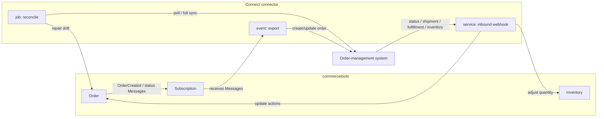

# OMS sync architecture

The deliverable regardless of ladder rung (use/configure/fork/build): the **flows**, the **Messages** the export subscribes to, the **state mapping**, and the **idempotency strategy per flow**. This applies whether you configure a public connector, fork one, or build a new one — the design is the same; only who implements it differs.

Fetch exact fields/actions with the parent skill's schema scripts before writing code — do not hardcode field lists from memory:
`node scripts/openApi-schemata.mjs --resource-name api-Order-write` (update actions), `--resource-name api-Order-read`, `--resource-name api-InventoryEntry-write`; and `node scripts/graphql-schemata.mjs --resource-name Order`. Message shapes: [Cart and Order Messages](https://docs.commercetools.com/api/projects/messages/cart-order-messages.md).

## The three flows

Design as **one-way flows per data domain** (see [overview.md → Direction & source of truth](./overview.md)). A typical OMS connector needs two, sometimes three:

### 1. Export — `event` application (commercetools → OMS)

React to a placed Order and push it downstream. Build on [event-applications.md](../../event-applications.md) — it owns the platform contract; below is only what's OMS-specific.

- **Subscribe to the right Messages.** `OrderCreated` for the initial export; add order-lifecycle Messages only if the OMS must also learn about commercetools-side changes (`OrderStateChanged`, `OrderCustomerSet`, edits). Subscribe to the *minimum* set and ack-and-ignore the rest. Message catalog: [Cart and Order Messages](https://docs.commercetools.com/api/projects/messages/cart-order-messages.md). The `fulfilment-integration` template's `order-export` app is the canonical working example — it subscribes to `OrderCreated` / `ReturnInfoAdded` ([connect-fulfilment-integration-template](https://github.com/commercetools/connect-fulfilment-integration-template)); the tax template's `order-syncer` is a secondary `OrderCreated`-subscriber reference.
- **Re-fetch the Order by `resource.id`** — don't trust the Message payload (it may be omitted when `payloadNotIncluded`). Fetch the full Order, map it, then push.
- **Idempotent export.** At-least-once delivery means the same `OrderCreated` can arrive twice. Make the OMS create idempotent: prefer the OMS's own idempotency key (send the commercetools `orderNumber` or Order `id` as the OMS external reference and upsert), or check the OMS for an existing record before creating. **Never** keep a local dedup store.
- **Record the OMS id back on the Order** so inbound updates and reconciliation can correlate — and so the export can detect "already exported". Order has **no top-level `externalId`**; use the purpose-built [`SyncInfo`](https://docs.commercetools.com/api/projects/orders.md) via the `updateSyncInfo` action (it carries `externalId` + `channel` and is exactly "synchronization activity information of the Order like export or import"), or a Custom Field. Query it back with the `syncInfo(externalId="…")` predicate (or the custom-field predicate).
- **Timing.** If Orders should export only after payment/approval, either subscribe to the state-change Message instead of `OrderCreated`, or gate inside the handler on the Order's payment/approval state.

### 2. Inbound — `service` application as an inbound webhook (OMS → commercetools)

The OMS calls your endpoint when status, shipment, fulfillment, or inventory changes. Build on [service-applications.md](../../service-applications.md) as the **inbound-webhook** mode (5-min service timeout, not the 2-s Extension limit; you authenticate the caller and call the commercetools API yourself — no Extension is registered).

- **Authenticate the caller** and validate the payload before touching commercetools ([security.md](../../security.md)).
- **Correlate** the inbound event to the commercetools Order by the stored OMS id — query by the `syncInfo(externalId="…")` predicate or a Custom Field predicate — not by position.
- **Apply as Order update actions**, then persist. Common mappings (fetch exact action names via `openApi-schemata.mjs --resource-name api-Order-write`):
  - order-level status → `changeOrderState` (`Open`/`Confirmed`/`Complete`/`Cancelled`) and/or a custom `State` machine via `transitionState`
  - line-item fulfillment status → `transitionLineItemState` (custom line-item `State`)
  - shipment status → `changeShipmentState` (`Shipped`, `Delayed`, `Ready`, …)
  - shipment/tracking → `addDelivery`, `addParcelToDelivery`, `setParcelTrackingData` (and `Delivery`/`Parcel` custom fields for extra data)
  - returns/RMA → `addReturnInfo`, `setReturnShipmentState`
  - inventory → adjust the relevant `InventoryEntry` `quantityOnStock` for the SKU + supply channel (`api-InventoryEntry-write`)
- **Idempotent apply.** Re-check current state before transitioning — a redelivered "Shipped" must be a no-op, and an out-of-order older event must not overwrite a newer state. Use the version/sequence the OMS provides (or the Order `version` for optimistic concurrency) and guard the transition. Decide what a failed write returns so the OMS can retry safely.

### 3. Reconcile — `job` application (optional but recommended)

A scheduled full/delta sync that repairs drift the event/webhook path missed (dropped webhook, poison message, backfill). Build on [job-applications.md](../../job-applications.md): owns its own overlap locking and restart-safe checkpointing; each unit idempotent so a re-run can't double-write. Use it for nightly inventory snapshots and to re-push Orders the OMS never acknowledged.

## State mapping (produce this table for the user)

The single most error-prone part is mapping OMS statuses onto commercetools' several state fields. commercetools separates concerns across `orderState`, `shipmentState`, `paymentState`, a custom order `State` machine, and per-line-item `State` — the OMS usually has its own status vocabulary. Produce an explicit mapping table, e.g.:

| OMS status | commercetools target | Action |
|---|---|---|
| `RECEIVED` | order custom `State` = "Received" | `transitionState` |
| `ALLOCATED` / `PICKING` | line-item `State` | `transitionLineItemState` |
| `SHIPPED` (+ tracking) | `shipmentState` = `Shipped`; add delivery/parcel | `changeShipmentState`, `addDelivery`, `addParcelToDelivery`, `setParcelTrackingData` |
| `DELIVERED` | `orderState` = `Complete` | `changeOrderState` |
| `CANCELLED` | `orderState` = `Cancelled` | `changeOrderState` |
| `RETURN_INITIATED` | return info | `addReturnInfo`, `setReturnShipmentState` |

If the required order statuses don't exist as built-in `orderState` values, model them with a custom [State](https://docs.commercetools.com/api/projects/states.md) machine and register the States + transitions idempotently in `postDeploy` ([lifecycle-scripts.md](../../lifecycle-scripts.md)). Decide up front which side wins on conflict for each field (source of truth), and make the other side read-only for that field.

## Idempotency & anti-loop (the invariants to pin as tests)

- **Export idempotent** on `orderNumber`/OMS external ref (upsert or check-first) — redelivered `OrderCreated` doesn't create a duplicate OMS order.
- **Inbound idempotent** — a redelivered status webhook is a no-op; an older event never overwrites a newer state (guard on version/sequence).
- **No loops.** If both an export subscription *and* an inbound webhook can touch order status, they must not master the same field. When the connector writes to the Order, that write emits its own Message — filter self-changes so the export doesn't re-push what the inbound flow just applied ([event-applications.md](../../event-applications.md) self-change filtering).
- **Correlation stored**, not inferred — OMS id on the Order via `syncInfo` (`updateSyncInfo`) or a Custom Field, never a bare `externalId` (Order has none).

## Checklist
- [ ] Flows chosen: export (`event`), inbound (`service` webhook), reconcile (`job`) as needed
- [ ] Export subscribes to the minimum Messages (`OrderCreated` + only the lifecycle Messages actually needed); re-fetches Order by id
- [ ] Export idempotent on `orderNumber`/OMS ref; OMS id recorded back on the Order
- [ ] Inbound authenticates the caller, correlates by stored OMS id, applies via Order update actions, and is idempotent (redelivery no-op, no stale overwrite)
- [ ] State-mapping table produced; custom `State` machine + transitions registered idempotently in postDeploy if needed
- [ ] Single source of truth per field; no bidirectional sync of the same field; self-change filtering prevents loops
- [ ] Inventory sync direction fixed; `InventoryEntry` updated per SKU + supply channel
- [ ] Reconcile job (if used) locks against overlap and checkpoints
